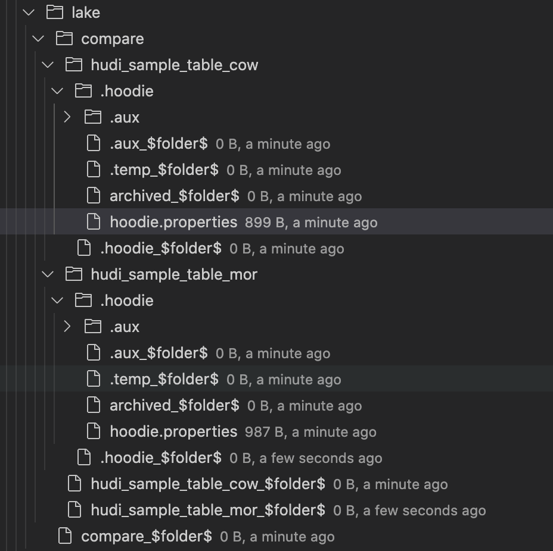

## Spark SQL
```
-- Apache Hudi
spark-sql \
--packages org.apache.hudi:hudi-spark3-bundle_2.12:0.9.0,org.apache.spark:spark-avro_2.12:3.0.1 \
--conf 'spark.serializer=org.apache.spark.serializer.KryoSerializer' \
--conf 'spark.sql.extensions=org.apache.spark.sql.hudi.HoodieSparkSessionExtension'


```

## Create Table
### create a COW table
```sql
create table if not exists hudi_sample_table_cow (
    id bigint,    name string,    dt string,    hour string 
) using hudi
location 's3://akshaya-firehose-test/lake/compare/hudi/hudi_sample_table_cow'
options (
  type = 'cow',
  primaryKey = 'id'
 ) 
partitioned by (dt, hour);

/// s3://akshaya-firehose-test/lake/compare/hudi_sample_table_cow/.hoodie/hoodie.properties
#Properties saved on Mon Nov 29 05:30:35 UTC 2021
#Mon Nov 29 05:30:35 UTC 2021
hoodie.table.precombine.field=_hoodie_commit_time
hoodie.table.partition.fields=dt,hh
hoodie.table.type=COPY_ON_WRITE
hoodie.archivelog.folder=archived
hoodie.timeline.layout.version=1
hoodie.table.version=2
hoodie.table.recordkey.fields=id
hoodie.table.name=hudi_sample_table_cow
hoodie.table.create.schema={"type"\:"record","name"\:"topLevelRecord","fields"\:[{"name"\:"_hoodie_commit_time","type"\:["string","null"]},{"name"\:"_hoodie_commit_seqno","type"\:["string","null"]},{"name"\:"_hoodie_record_key","type"\:["string","null"]},{"name"\:"_hoodie_partition_path","type"\:["string","null"]},{"name"\:"_hoodie_file_name","type"\:["string","null"]},{"name"\:"id","type"\:["long","null"]},{"name"\:"name","type"\:["string","null"]},{"name"\:"dt","type"\:["string","null"]},{"name"\:"hh","type"\:["string","null"]}]}


```
### create a MOR table
```sql

create table if not exists hudi_sample_table_mor (
    id bigint,    name string,    dt string ,    hour string 
) using hudi
location 's3://akshaya-firehose-test/lake/compare/hudi/hudi_sample_table_mor'
options (
  type = 'mor',
  primaryKey = 'id'
)
partitioned by (dt, hour);

/// s3://akshaya-firehose-test/lake/compare/hudi_sample_table_mor/.hoodie/hoodie.properties
#Properties saved on Mon Nov 29 05:30:57 UTC 2021
#Mon Nov 29 05:30:57 UTC 2021
hoodie.table.precombine.field=_hoodie_commit_time
hoodie.table.partition.fields=dt,hh
hoodie.table.type=MERGE_ON_READ
hoodie.archivelog.folder=archived
hoodie.compaction.payload.class=org.apache.hudi.common.model.DefaultHoodieRecordPayload
hoodie.timeline.layout.version=1
hoodie.table.version=2
hoodie.table.recordkey.fields=id
hoodie.table.name=hudi_sample_table_mor
hoodie.table.create.schema={"type"\:"record","name"\:"topLevelRecord","fields"\:[{"name"\:"_hoodie_commit_time","type"\:["string","null"]},{"name"\:"_hoodie_commit_seqno","type"\:["string","null"]},{"name"\:"_hoodie_record_key","type"\:["string","null"]},{"name"\:"_hoodie_partition_path","type"\:["string","null"]},{"name"\:"_hoodie_file_name","type"\:["string","null"]},{"name"\:"id","type"\:["long","null"]},{"name"\:"name","type"\:["string","null"]},{"name"\:"dt","type"\:["string","null"]},{"name"\:"hh","type"\:["string","null"]}]}


```




## Insert Data
```
-- Apache Hudi
insert into hudi_sample_table_cow select 1 as id, 'First' as name , '2021-11-28' as dt, '12' as hour ;
insert into hudi_sample_table_cow partition(dt = '2021-11-29' , hour='11') select 2 as id , 'Second';

insert into hudi_sample_table_mor select 1 as id, 'First' as name , '2021-11-28' as dt, '12' as hour ;
insert into hudi_sample_table_mor partition(dt = '2021-11-29' , hour='11') select 2 as id , 'Second';

select * from hudi_sample_table_cow ;
20211202101856	20211202101856_0_1	id:1	dt=2021-11-28/hour=12	ab850517-20fe-4385-9a33-14e1c43e7532-0_0-361-17331_20211202101856.parquet	1	First	2021-11-28	12
20211202101919	20211202101919_0_2	id:2	dt=2021-11-29/hour=11	2d41d295-e2ce-4b29-8aff-b3cd2e7e6e40-0_0-394-18943_20211202101919.parquet	2	Second	2021-11-29	11
Time taken: 1.598 seconds, Fetched 2 row(s)

select * from hudi_sample_table_mor ;
---Errors out

select * from hudi_sample_table_mor_ro  ;
20211202102822	20211202102822_0_1	id:1	dt=2021-11-28/hour=12	f71db8f3-5604-4f8d-839f-5221a35c9ec6-0_0-534-25415_20211202102822.parquet	1	First	2021-11-28	12
20211202102857	20211202102857_0_1	id:2	dt=2021-11-29/hour=11	2771671d-5347-43e2-8327-92082f1c00e7-0_0-563-27023_20211202102857.parquet	2	Second	2021-11-29	11

select * from hudi_sample_table_mor_rt  ;
---Errors out


```
### Content of .hoodie/20211129124353.commit for COW table
```json

{
  "partitionToWriteStats": {
    "default": [
      {
        "fileId": "5a9f85e6-a74a-43b1-89bf-521102fcc212-0",
        "path": "default/5a9f85e6-a74a-43b1-89bf-521102fcc212-0_0-98-98_20211129124353.parquet",
        "prevCommit": "20211129123734",
        "numWrites": 1,
        "numDeletes": 0,
        "numUpdateWrites": 1,
        "numInserts": 0,
        "totalWriteBytes": 434867,
        "totalWriteErrors": 0,
        "tempPath": null,
        "partitionPath": "default",
        "totalLogRecords": 0,
        "totalLogFilesCompacted": 0,
        "totalLogSizeCompacted": 0,
        "totalUpdatedRecordsCompacted": 0,
        "totalLogBlocks": 0,
        "totalCorruptLogBlock": 0,
        "totalRollbackBlocks": 0,
        "fileSizeInBytes": 434867,
        "minEventTime": null,
        "maxEventTime": null
      }
    ]
  },
  "compacted": false,
  "extraMetadata": {
    "schema": "{\"type\":\"record\",\"name\":\"hudi_sample_table_cow_record\",\"namespace\":\"hoodie.hudi_sample_table_cow\",\"fields\":[{\"name\":\"id\",\"type\":\"int\"},{\"name\":\"name\",\"type\":[\"null\",\"string\"],\"default\":null},{\"name\":\"dt\",\"type\":[\"null\",\"string\"],\"default\":null},{\"name\":\"hh\",\"type\":[\"null\",\"string\"],\"default\":null}]}"
  },
  "operationType": "UPSERT",
  "fileIdAndRelativePaths": {
    "5a9f85e6-a74a-43b1-89bf-521102fcc212-0": "default/5a9f85e6-a74a-43b1-89bf-521102fcc212-0_0-98-98_20211129124353.parquet"
  },
  "totalRecordsDeleted": 0,
  "totalLogRecordsCompacted": 0,
  "totalLogFilesCompacted": 0,
  "totalCompactedRecordsUpdated": 0,
  "totalLogFilesSize": 0,
  "totalScanTime": 0,
  "totalCreateTime": 0,
  "totalUpsertTime": 853,
  "minAndMaxEventTime": {
    "Optional.empty": {
      "val": null,
      "present": false
    }
  },
  "writePartitionPaths": [
    "default"
  ]
}
```
### Content of .hoodie/20211129131046.commit for MOR table
```json
{
  "partitionToWriteStats": {
    "default": [
      {
        "fileId": "3ef578a8-7e0c-4cfc-99b0-afbe8e5b2e19-0",
        "path": "default/.3ef578a8-7e0c-4cfc-99b0-afbe8e5b2e19-0_20211129130020.log.15_0-476-462",
        "prevCommit": "20211129130020",
        "numWrites": 2,
        "numDeletes": 0,
        "numUpdateWrites": 2,
        "numInserts": 0,
        "totalWriteBytes": 1020,
        "totalWriteErrors": 0,
        "tempPath": null,
        "partitionPath": "default",
        "totalLogRecords": 0,
        "totalLogFilesCompacted": 0,
        "totalLogSizeCompacted": 0,
        "totalUpdatedRecordsCompacted": 0,
        "totalLogBlocks": 0,
        "totalCorruptLogBlock": 0,
        "totalRollbackBlocks": 0,
        "fileSizeInBytes": 1020,
        "minEventTime": null,
        "maxEventTime": null,
        "logVersion": 15,
        "logOffset": 0,
        "baseFile": "3ef578a8-7e0c-4cfc-99b0-afbe8e5b2e19-0_0-20-21_20211129130020.parquet",
        "logFiles": [
          ".3ef578a8-7e0c-4cfc-99b0-afbe8e5b2e19-0_20211129130020.log.14_0-444-431",
          ".3ef578a8-7e0c-4cfc-99b0-afbe8e5b2e19-0_20211129130020.log.13_0-412-400",
          ".3ef578a8-7e0c-4cfc-99b0-afbe8e5b2e19-0_20211129130020.log.12_0-380-369",
          ".3ef578a8-7e0c-4cfc-99b0-afbe8e5b2e19-0_20211129130020.log.11_0-348-338",
          ".3ef578a8-7e0c-4cfc-99b0-afbe8e5b2e19-0_20211129130020.log.10_0-316-307",
          ".3ef578a8-7e0c-4cfc-99b0-afbe8e5b2e19-0_20211129130020.log.9_0-287-279",
          ".3ef578a8-7e0c-4cfc-99b0-afbe8e5b2e19-0_20211129130020.log.8_0-258-251",
          ".3ef578a8-7e0c-4cfc-99b0-afbe8e5b2e19-0_20211129130020.log.7_0-229-223",
          ".3ef578a8-7e0c-4cfc-99b0-afbe8e5b2e19-0_20211129130020.log.6_0-200-195",
          ".3ef578a8-7e0c-4cfc-99b0-afbe8e5b2e19-0_20211129130020.log.5_0-171-167",
          ".3ef578a8-7e0c-4cfc-99b0-afbe8e5b2e19-0_20211129130020.log.4_0-142-139",
          ".3ef578a8-7e0c-4cfc-99b0-afbe8e5b2e19-0_20211129130020.log.3_0-113-111",
          ".3ef578a8-7e0c-4cfc-99b0-afbe8e5b2e19-0_20211129130020.log.2_0-84-83",
          ".3ef578a8-7e0c-4cfc-99b0-afbe8e5b2e19-0_20211129130020.log.1_0-52-52",
          ".3ef578a8-7e0c-4cfc-99b0-afbe8e5b2e19-0_20211129130020.log.15_0-476-462"
        ]
      }
    ]
  },
  "compacted": false,
  "extraMetadata": {
    "schema": "{\"type\":\"record\",\"name\":\"hudi_sample_table_mor_record\",\"namespace\":\"hoodie.hudi_sample_table_mor\",\"fields\":[{\"name\":\"id\",\"type\":\"int\"},{\"name\":\"name\",\"type\":[\"null\",\"string\"],\"default\":null},{\"name\":\"dt\",\"type\":[\"null\",\"string\"],\"default\":null},{\"name\":\"hh\",\"type\":[\"null\",\"string\"],\"default\":null}]}"
  },
  "operationType": "UPSERT",
  "totalRecordsDeleted": 0,
  "totalLogRecordsCompacted": 0,
  "totalLogFilesCompacted": 0,
  "totalCompactedRecordsUpdated": 0,
  "totalLogFilesSize": 0,
  "totalScanTime": 0,
  "totalCreateTime": 0,
  "totalUpsertTime": 438,
  "minAndMaxEventTime": {
    "Optional.empty": {
      "val": null,
      "present": false
    }
  },
  "writePartitionPaths": [
    "default"
  ],
  "fileIdAndRelativePaths": {
    "3ef578a8-7e0c-4cfc-99b0-afbe8e5b2e19-0": "default/.3ef578a8-7e0c-4cfc-99b0-afbe8e5b2e19-0_20211129130020.log.15_0-476-462"
  }
}
```

## Query Data
```
-- Apache Hudi
select id, name, dt, hour from  hudi_sample_table_cow where id=1 ;
select id, name, dt, hour from  hudi_sample_table_mor_ro where id=1 ;
spark-sql> select id, name, dt, hour from  hudi_sample_table_cow where id=1 ;
1	First	2021-11-28	12
Time taken: 8.875 seconds, Fetched 1 row(s)
spark-sql> select id, name, dt, hour from  hudi_sample_table_mor_ro where id=1 ;
1	First	2021-11-28	12
Time taken: 0.564 seconds, Fetched 1 row(s)

select * from  hudi_sample_table_cow ;
select * from  hudi_sample_table_mor_ro ;

 
```

## Update Merge

```
-- Apache Hudi
merge into hudi_sample_table_cow as target
using (  select 3 as id, 'Third Merge' as name, '2021-11-29' as dt, '11' hour ) source on target.id = source.id when matched then update set *
when not matched then insert * ;

merge into hudi_sample_table_cow as target
using (  select 2 as id, 'Second Update' as name, '2021-12-29' as dt, '10' hour) source on target.id = source.id when matched then update set *
when not matched then insert * ;

merge into hudi_sample_table_mor as target
using (  select 3 as id, 'Third Merge' as name, '2021-11-29' as dt, '11' as hour) source on target.id = source.id when matched then update set *
when not matched then insert * ;

merge into hudi_sample_table_mor as target
using (  select 2 as id, 'Second Update' as name, '2021-12-29' as dt, '10' as hour) source on target.id = source.id when matched then update set *
when not matched then insert * ;

select * from hudi_sample_table_mor_ro ;
select * from hudi_sample_table_cow ;

spark-sql> select * from hudi_sample_table_mor_ro ;
20211202102822	20211202102822_0_1	id:1	dt=2021-11-28/hour=12	f71db8f3-5604-4f8d-839f-5221a35c9ec6-0_0-534-25415_20211202102822.parquet	1	First	2021-11-28	12
20211202102857	20211202102857_0_1	id:2	dt=2021-11-29/hour=11	2771671d-5347-43e2-8327-92082f1c00e7-0_0-563-27023_20211202102857.parquet	2	Second	2021-11-29	11
Time taken: 0.512 seconds, Fetched 2 row(s)
spark-sql> select * from hudi_sample_table_cow ;
20211202103623	20211202103623_0_1	id:2	dt=2021-12-29/hour=10	e66de3df-6e20-49c0-afb2-9eda9339b75c-0_0-648-30287_20211202103623.parquet	2	Second Update	2021-12-29	10
20211202101856	20211202101856_0_1	id:1	dt=2021-11-28/hour=12	ab850517-20fe-4385-9a33-14e1c43e7532-0_0-361-17331_20211202101856.parquet	1	First	2021-11-28	12
20211202101919	20211202101919_0_2	id:2	dt=2021-11-29/hour=11	2d41d295-e2ce-4b29-8aff-b3cd2e7e6e40-0_0-394-18943_20211202101919.parquet	2	Second	2021-11-29	11
20211202103550	20211202103550_0_1	id:3	dt=2021-11-29/hour=11	2d41d295-e2ce-4b29-8aff-b3cd2e7e6e40-0_0-615-28672_20211202103550.parquet	3	Third Merge	2021-11-29	11


```

## Update Data
```
-- Apache Hudi
update  hudi_sample_table_cow  set  name = 'Updated First' where id=1 ;
update  hudi_sample_table_mor  set  name =  'Updated First' where id=1 ;

select * from  hudi_sample_table_cow ;
select * from  hudi_sample_table_mor_ro ;
         > select * from  hudi_sample_table_cow ;
20211202103623	20211202103623_0_1	id:2	dt=2021-12-29/hour=10	e66de3df-6e20-49c0-afb2-9eda9339b75c-0_0-648-30287_20211202103623.parquet	2	Second Update	2021-12-29	10
20211202113904	20211202113904_0_1	id:1	dt=2021-11-28/hour=12	ab850517-20fe-4385-9a33-14e1c43e7532-0_0-793-37199_20211202113904.parquet	1	Updated First	2021-11-28	12
20211202101919	20211202101919_0_2	id:2	dt=2021-11-29/hour=11	2d41d295-e2ce-4b29-8aff-b3cd2e7e6e40-0_0-394-18943_20211202101919.parquet	2	Second	2021-11-29	11
20211202103550	20211202103550_0_1	id:3	dt=2021-11-29/hour=11	2d41d295-e2ce-4b29-8aff-b3cd2e7e6e40-0_0-615-28672_20211202103550.parquet	3	Third Merge	2021-11-29	11
Time taken: 1.77 seconds, Fetched 4 row(s)

 
```

## Delete data
```
-- Apache Hudi
delete from  hudi_sample_table_cow  where id=1 ;
delete from  hudi_sample_table_mor  where id=1 ;

select * from  hudi_sample_table_cow ;
select * from  hudi_sample_table_mor_ro ;

spark-sql> select * from  hudi_sample_table_cow ;
20211202103623	20211202103623_0_1	id:2	dt=2021-12-29/hour=10	e66de3df-6e20-49c0-afb2-9eda9339b75c-0_0-648-30287_20211202103623.parquet	2	Second Update	2021-12-29	10
20211202101919	20211202101919_0_2	id:2	dt=2021-11-29/hour=11	2d41d295-e2ce-4b29-8aff-b3cd2e7e6e40-0_0-394-18943_20211202101919.parquet	2	Second	2021-11-29	11
20211202103550	20211202103550_0_1	id:3	dt=2021-11-29/hour=11	2d41d295-e2ce-4b29-8aff-b3cd2e7e6e40-0_0-615-28672_20211202103550.parquet	3	Third Merge	2021-11-29	11
Time taken: 0.995 seconds, Fetched 3 row(s)
spark-sql> select * from  hudi_sample_table_mor_ro ;
20211202102822	20211202102822_0_1	id:1	dt=2021-11-28/hour=12	f71db8f3-5604-4f8d-839f-5221a35c9ec6-0_0-534-25415_20211202102822.parquet	1	First	2021-11-28	12
20211202102857	20211202102857_0_1	id:2	dt=2021-11-29/hour=11	2771671d-5347-43e2-8327-92082f1c00e7-0_0-563-27023_20211202102857.parquet	2	Second	2021-11-29	11
Time taken: 0.407 seconds, Fetched 2 row(s)


```
